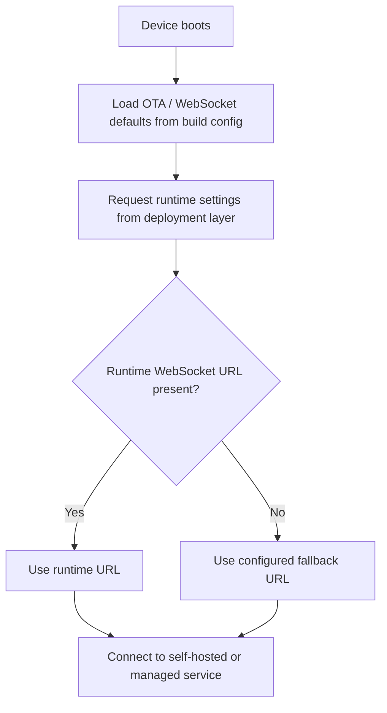

# xiaozhi-esp32-selfhost-playbook

Public-safe notes, examples, and deployment ideas for self-hosting custom routing on `xiaozhi-esp32`.

## Upstream Reference

This repository is based on exploration work around the upstream project:

- Upstream repository: [78/xiaozhi-esp32](https://github.com/78/xiaozhi-esp32)
- Upstream description: `An MCP-based chatbot`
- Upstream license: `MIT`

This repo does **not** mirror or republish the full upstream codebase. It is a clean, portfolio-safe companion repository that documents a custom self-host routing approach inspired by real integration work.

## What This Repo Focuses On

- adding a configurable OTA endpoint for self-hosted environments
- adding a configurable WebSocket endpoint for self-hosted environments
- providing a fallback routing strategy when runtime settings are empty
- documenting a clean publication pattern that avoids exposing private endpoints and secrets

## Why It Exists

I used `xiaozhi-esp32` as the upstream reference for ESP32 AI device experimentation. One practical problem in local deployment is that devices often need to switch from public defaults to private self-hosted services during development, testing, or LAN demos.

This playbook turns that idea into a reusable public artifact:

- architecture notes
- configuration templates
- clean-room example logic
- release hygiene checklist

## Repository Structure

- [`docs/upstream-notes.md`](./docs/upstream-notes.md): what was confirmed from upstream and what kind of customization this playbook describes
- [`docs/selfhost-routing-strategy.md`](./docs/selfhost-routing-strategy.md): self-host routing strategy and implementation ideas
- [`examples/sdkconfig.defaults.example`](./examples/sdkconfig.defaults.example): sanitized configuration example
- [`examples/url_resolution_example.cpp`](./examples/url_resolution_example.cpp): clean-room sample logic for URL fallback resolution
- [`NOTICE.md`](./NOTICE.md): attribution and publication boundary

## Routing Model

## Typical Use Cases

- classroom or lab demos with LAN-deployed services
- internal testing against self-hosted OTA and WebSocket gateways
- portfolio documentation for embedded AI integration ability
- environment-specific build variants without publishing private infrastructure

## Quick Start

1. Read [`docs/upstream-notes.md`](./docs/upstream-notes.md) to understand the upstream relationship.
2. Copy the sanitized patterns from [`examples/sdkconfig.defaults.example`](./examples/sdkconfig.defaults.example).
3. Adapt the fallback logic shown in [`examples/url_resolution_example.cpp`](./examples/url_resolution_example.cpp) to your own fork or private branch.
4. Replace placeholder addresses with your own local or cloud endpoints.
5. Keep tokens, internal IPs, and deployment-only configs out of public repositories.

## Portfolio Value

This repository is designed to showcase:

- ESP32 integration thinking
- AI hardware deployment awareness
- self-host routing design
- clean public documentation habits
- respect for upstream attribution and open-source boundaries

## Publication Note

If you want to build a production fork, start from the upstream repository instead of this documentation repo:

- [78/xiaozhi-esp32](https://github.com/78/xiaozhi-esp32)

This repository is intentionally lightweight and documentation-first.
