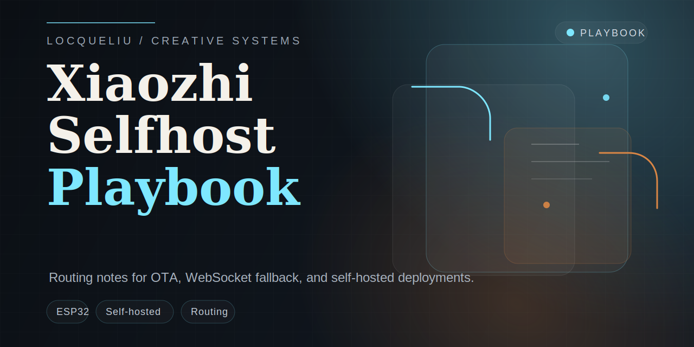
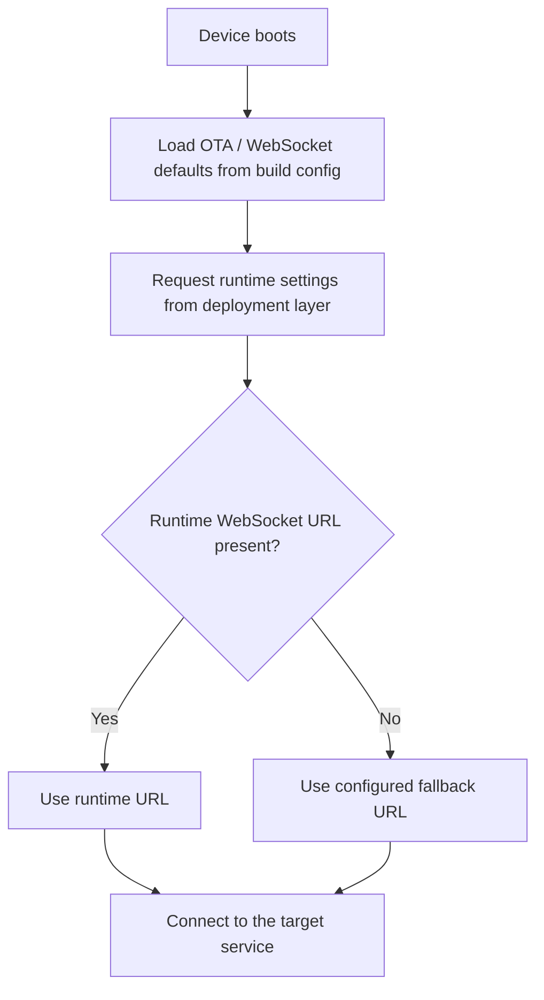

# xiaozhi-esp32-selfhost-playbook

[Chinese Version](./README_zh.md)

This repository records how I think about self-hosted routing around `xiaozhi-esp32` deployments.

When I run ESP32 voice devices against local or self-managed services, the practical problem is usually not the hardware itself but the routing strategy: where OTA checks go, which WebSocket endpoint gets used, and what should happen when runtime settings are incomplete.

## Upstream

- Repository: [78/xiaozhi-esp32](https://github.com/78/xiaozhi-esp32)
- Description: `An MCP-based chatbot`
- License observed: `MIT`

The upstream project is the right starting point for actual firmware work. This repository keeps the notes, config patterns, and small reusable examples that grew out of my deployment-side experimentation.

## What I keep here

- OTA and WebSocket fallback ideas for self-hosted environments
- routing notes for local network and private deployment setups
- sanitized configuration examples
- small clean-room snippets for URL resolution logic

## Repository structure

- [`docs/upstream-notes.md`](./docs/upstream-notes.md) upstream relationship and customization scope
- [`docs/selfhost-routing-strategy.md`](./docs/selfhost-routing-strategy.md) routing design and fallback order
- [`examples/sdkconfig.defaults.example`](./examples/sdkconfig.defaults.example) example config values
- [`examples/url_resolution_example.cpp`](./examples/url_resolution_example.cpp) minimal fallback logic
- [`NOTICE.md`](./NOTICE.md) attribution and release boundary

## Routing model

## Why I keep this split out

Keeping deployment notes separate from the firmware itself makes a few things easier:

- firmware branches stay focused on code
- routing assumptions stay documented in one place
- local and self-hosted setups are easier to revisit later
- sensitive endpoints and private configs stay out of the repo

## Typical use cases

- LAN demos with self-hosted gateways
- local testing against internal OTA and WebSocket services
- switching between managed and self-managed service targets
- keeping fallback behavior predictable during development

## Quick start

1. Read [`docs/upstream-notes.md`](./docs/upstream-notes.md)
2. Review the fallback order in [`docs/selfhost-routing-strategy.md`](./docs/selfhost-routing-strategy.md)
3. Copy the config style from [`examples/sdkconfig.defaults.example`](./examples/sdkconfig.defaults.example)
4. Adapt the sample logic in [`examples/url_resolution_example.cpp`](./examples/url_resolution_example.cpp) to your own branch

## Note

If you want to build or ship firmware, start from the upstream repository:

- [78/xiaozhi-esp32](https://github.com/78/xiaozhi-esp32)
