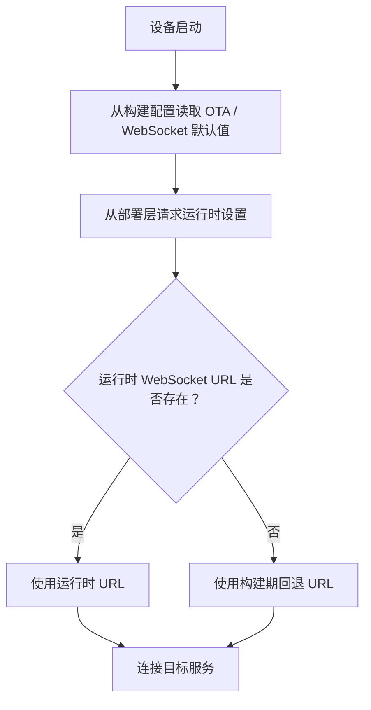

# xiaozhi-esp32-selfhost-playbook

[English Version](./README.md)

这个仓库主要记录我在 `xiaozhi-esp32` 相关部署里，怎么处理自托管路由这件事。

做 ESP32 语音设备的时候，很多麻烦其实不在硬件本身，而在部署细节上：OTA 检查走哪里、WebSocket 默认连哪里、运行时配置不完整时应该怎么回退。这些问题我更愿意单独整理出来，而不是散在分支改动里。

## 上游项目

- 仓库： [78/xiaozhi-esp32](https://github.com/78/xiaozhi-esp32)
- 描述：`An MCP-based chatbot`
- 观察到的许可证：`MIT`

真正的固件开发应该从上游仓库开始，这里主要保留我在部署侧逐步整理出来的笔记、配置方式和小型可复用示例。

## 这里主要放什么

- 面向自托管环境的 OTA / WebSocket 回退思路
- 本地网络和私有部署场景下的路由记录
- 经过净化后的配置示例
- URL 解析和回退逻辑的小型 clean-room 代码片段

## 仓库结构

- [`docs/upstream-notes.md`](./docs/upstream-notes.md) 上游关系与自定义范围
- [`docs/selfhost-routing-strategy.md`](./docs/selfhost-routing-strategy.md) 路由设计与回退顺序
- [`examples/sdkconfig.defaults.example`](./examples/sdkconfig.defaults.example) 示例配置
- [`examples/url_resolution_example.cpp`](./examples/url_resolution_example.cpp) 最小回退逻辑
- [`NOTICE.md`](./NOTICE.md) 来源说明与发布边界

## 路由模型

## 我为什么把这部分单独拆出来

把部署和路由笔记从固件主体里拆开，有几个明显好处：

- 固件分支可以更专注于代码本身
- 路由假设能在一个地方集中记录
- 本地和自托管环境后面更容易复现
- 敏感地址和私有配置不会混进仓库

## 常见使用场景

- 局域网演示时接自建网关
- 本地测试时连接内部 OTA / WebSocket 服务
- 在托管服务和自托管服务之间切换
- 开发阶段保持回退行为可预期

## 快速开始

1. 先看 [`docs/upstream-notes.md`](./docs/upstream-notes.md)
2. 再看 [`docs/selfhost-routing-strategy.md`](./docs/selfhost-routing-strategy.md) 里的回退顺序
3. 参考 [`examples/sdkconfig.defaults.example`](./examples/sdkconfig.defaults.example) 的配置写法
4. 根据你自己的分支改造 [`examples/url_resolution_example.cpp`](./examples/url_resolution_example.cpp) 里的逻辑

## 说明

如果你要继续做或发布固件，还是应该从上游仓库开始：

- [78/xiaozhi-esp32](https://github.com/78/xiaozhi-esp32)
