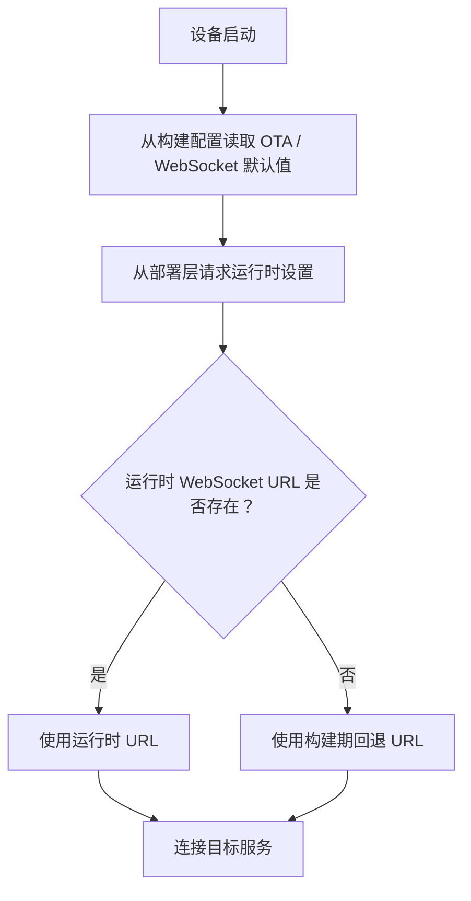

# xiaozhi-esp32-selfhost-playbook

[English Version](./README.md)

这个仓库主要是我在记 `xiaozhi-esp32` 自托管部署这条线上的一些坑和处理思路。

真正在折腾这类 ESP32 设备的时候，很多问题不在“能不能跑起来”，而在“后面会不会越来越乱”。比如 OTA 默认往哪走、WebSocket 该连哪里、运行时配置没给全的时候到底怎么回退，这些东西如果前面不理顺，后面每换一次环境都像在重开。

所以我干脆把这部分单独拎出来，免得散在分支改动里，过一阵子连自己都找不到。

## 上游项目

- 仓库： [78/xiaozhi-esp32](https://github.com/78/xiaozhi-esp32)
- 描述：`An MCP-based chatbot`
- 观察到的许可证：`MIT`

真正做固件还是应该从上游仓库开始，这里主要放我在部署、自托管和路由处理这部分慢慢攒下来的笔记和示例。

## 这里主要记什么

- 自托管环境下 OTA / WebSocket 的回退思路
- 本地网络和私有部署里的路由处理
- 去掉敏感信息后的配置示例
- URL 解析和回退逻辑的小型 clean-room 代码片段

## 仓库结构

- [`docs/upstream-notes.md`](./docs/upstream-notes.md) 上游关系和自定义范围
- [`docs/selfhost-routing-strategy.md`](./docs/selfhost-routing-strategy.md) 路由设计和回退顺序
- [`examples/sdkconfig.defaults.example`](./examples/sdkconfig.defaults.example) 示例配置
- [`examples/url_resolution_example.cpp`](./examples/url_resolution_example.cpp) 最小回退逻辑
- [`NOTICE.md`](./NOTICE.md) 来源说明和发布边界

## 路由模型

## 我为什么把这部分单独放

因为这样真的省事：

- 固件分支可以更专心写代码
- 路由相关的判断能集中记在一个地方
- 本地环境和自托管环境以后更容易重现
- 私有地址和敏感配置也不容易混进仓库

## 常见使用场景

- 局域网演示时接自建网关
- 本地测试时连内部 OTA / WebSocket 服务
- 在托管服务和自托管服务之间切换
- 开发阶段想把回退行为固定住

## 快速开始

1. 先看 [`docs/upstream-notes.md`](./docs/upstream-notes.md)
2. 再看 [`docs/selfhost-routing-strategy.md`](./docs/selfhost-routing-strategy.md) 里的回退顺序
3. 参考 [`examples/sdkconfig.defaults.example`](./examples/sdkconfig.defaults.example) 的配置写法
4. 按你自己的分支情况改 [`examples/url_resolution_example.cpp`](./examples/url_resolution_example.cpp)

## 说明

如果你是要继续做固件或者准备发固件，还是建议直接从上游仓库开始：

- [78/xiaozhi-esp32](https://github.com/78/xiaozhi-esp32)
